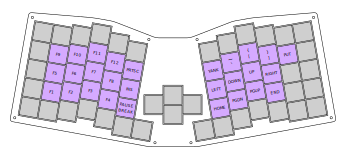

# CozyKeys Speedo

This repository contains the design files for the CozyKeys Speedo keyboard. The
Speedo is a 66-key ergonomic mechanical keyboard heavily inspired by the
Atreus/Atreus62.

## Features

- Powered by an Elite-C microcontroller
- Runs QMK firmware
- Compact ergonomic layout
- Supports underglow via 12 WS2812b RGB LEDs
- Low profile (Switches mounted ~13mm from surface keyboard sits on)
- Case/PCB design files free and open source

## Build Guide

A build guide and parts list are provided at
[./build_guide.md](./build_guide.md).

# Details

## Firmware

The Speedo runs the popular open source QMK firmware:

https://github.com/qmk/qmk_firmware/tree/master/keyboards/speedo

## Default Layout

### Default Layer

### Function Layer

## Case

The case is comprised of 4 layers:

- Top (3mm)
- Switch (4.5mm)
- Middle (4.5mm)
- Bottom (3mm)

### Top

### Switch

### Middle

### Bottom

## PCB

Artwork provided by [Racknar Teyssier](https://www.instagram.com/artbyrtm/)!

## Release Notes

### v3.0

After working on other keyboard projects for quite some time, I revisited the
Speedo with a number of changes:
- Removed the curved thumb key clusters
- Changed the center key layout to add some more space between the left and
  right sides
- Designed a PCB that uses the Elite-C microcontroller with support for 12
  WS2812b RGB LEDs
- Designed a new case to support the updated layout
- Changed versioning scheme to make more sense

### rev2

The second version fixed the thumb clusters. I had yet to get into PCB design
so this was only ever made via hand-wiring.

### rev1

The first version of the keyboard didn't account for the diameter of standard
keycaps and resulted in a case with faulty thumb

